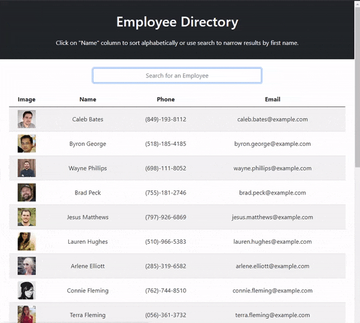

# Employee_Database
Employee Directory
## Table of Contents
- [Live Link](#Live-Link)
- [Repository Link](#Repository-Link)
- [Code Description](#Code-Description)
- [Installation](#Installation)
- [Function](#Function)
- [Demo](#Demo)
## Live Link
https://riraq.github.io/Employee_Database/
## Repository Link
https://github.com/riraq/Employee_Database
## Code Description
This application is built using React as well as https://randomuser.me/ in order to generate a list of employees. External dependencies not included in react that were needed include axios, bootstrap, and table-sort-js.
## Installation
1. Clone the repository from https://github.com/riraq/Employee_Database.
2. Run "npm i" in the main directory of the application in order to install dependencies.
## Function
The user requested an application that allows them to sort and filter their employees in order to view their non-sensitive information.
## Demo
